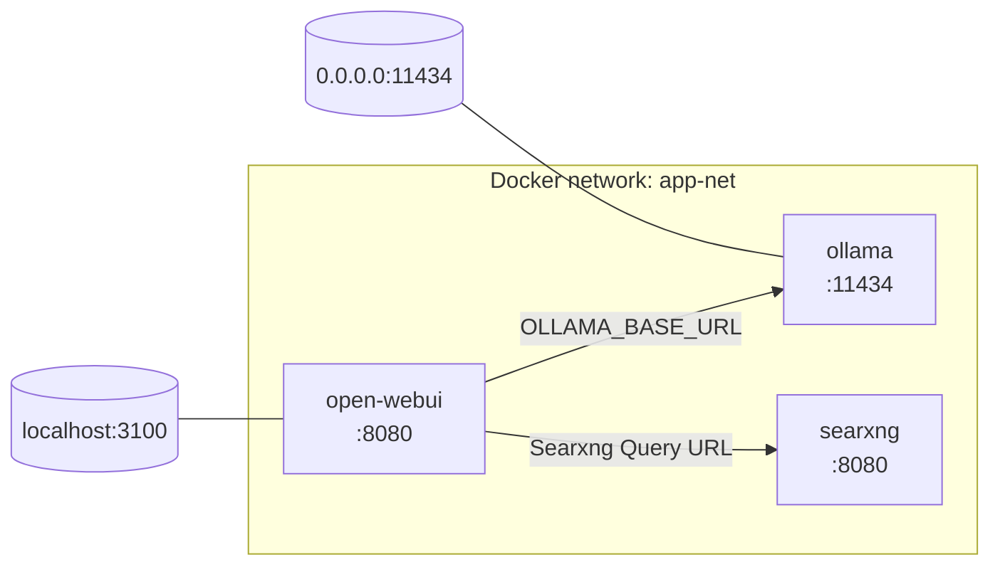

# Ollama + Open WebUI + SearXNG

A self-hosted stack for chatting with local models via [Ollama](https://ollama.com), with a web interface 
([Open WebUI](https://github.com/open-webui/open-webui)) and built-in web search with no dependency on a paid 
third-party API ([SearXNG](https://github.com/searxng/searxng)).

All three services run as Docker containers, managed by systemd, on a shared Docker network (`app-net`). \
Ollama's API is exposed on `0.0.0.0:11434`, Open WebUI is exposed on `0.0.0.0:3100`, 
both reachable from other machines on your network.

This repo targets **NVIDIA GPU setups only**. No CPU-only or AMD path is provided.

## Architecture



## Prerequisites

- Docker
- An NVIDIA GPU with drivers installed (`nvidia-smi` must work on the host)

## Quick start

```bash
git clone <repo-url>
cd ollama-webui-stack
sudo ./install.sh
```

Open WebUI is then available at `http://localhost:3100`. \
Ollama's API is available at `http://<this-machine's-IP>:11434` from any other machine on the network.

## Uninstalling

```bash
sudo ./install.sh --uninstall
```

## Open WebUI configuration

In **Admin Panel > Models > Model Defaults > Capabilities  > Configure**:
- ☑ Web Search

## Recommended models by usage

`llava:13b` for vision. Great picture analysis. \
`qwen2.5:7b` performs noticeably well in conversations. \
`qwen2.5-coder:7b` is recommended for its robust performance in development tasks.

## Exposing Services over the network

`ollama.service` publishes the API on `0.0.0.0:11434`, same for Open WebUI that is published on `0.0.0.0:3100`

eg for Windows in an admin powershell, `{40E0AC32-46A5-438A-A0B2-2B479E8F2E90}` is the WSL id by Microsoft:
```bash
New-NetFirewallHyperVRule -Name "WSL_TCP_Open_WebUI_3100" -DisplayName "WSL_TCP_Open_WebUI_3100" -Direction Inbound -VMCreatorId "{40E0AC32-46A5-438A-A0B2-2B479E8F2E90}" -Protocol TCP -LocalPorts 3100 -Action Allow
New-NetFirewallHyperVRule -Name "WSL_TCP_Ollama_11434" -DisplayName "WSL_TCP_Ollama_11434" -Direction Inbound -VMCreatorId "{40E0AC32-46A5-438A-A0B2-2B479E8F2E90}" -Protocol TCP -LocalPorts 11434 -Action Allow
```

## Timings

| Usage | First query | Next queries |
| --- | ---  | ---  |
| Open WebUI | 55 sec| 2 sec |
| Vision | 1m10 | 10s-12s |

## Sample commands to get started

### Clean and install stack

```powershell
sudo ./install.sh --uninstall && sudo ./install.sh
```

### Add several useful models to Ollama

```bash
docker exec -it ollama ollama pull qwen2.5:7b ; docker exec -it ollama ollama pull llava:13b ; docker exec -it ollama ollama pull qwen2.5-coder:7b
```